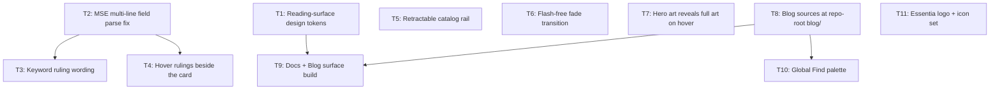

# Plan: website-feedback-pass-2

## Goal

Ship feedback batch 2 on the Astro site under `website/`: make every card show its
rule text (26 of 50 currently show none), align keyword rulings with new wording,
restyle the docs + blog reading surfaces, make the catalog rail retractable, widen
the search palette to docs / posts / decks, kill the page-transition flash, and move
blog sources to `blog/` at repo root. Success = every feedback line has a landing
ticket marked done, `npm run ci` green, `python -m unittest discover -s tests` green.

## Scope

- In: `website/` (Astro pages, components, styles, content build), `website/content/keywords.json`,
  `docs/keywords/*`, `docs/01_burning_abyss/KEYWORDS.md`, `docs/03_nekroz/KEYWORDS.md`,
  new repo-root `blog/`, `website/DESIGN.md`, `docs/ADR/proposed/*`,
  new `website/brand/` masters and `website/public/brand/` derivatives (T11).
- Out: MSE card sources under `cards_mse/` (except the one Draghig verification),
  `.script/` Python tooling (see Assumption A3), `launcher/`, `print/`, print pipeline,
  render regeneration, locked-package artefacts, deck **persistence** model,
  WEBSITE_V2_SPEC phases not named here.

## Assumptions

- **A1** — Repo uses `ai-artifacts/` (not the skill's `ai_artefacts/`). Plan files live there.
- **A2** — ADRs follow repo convention `docs/ADR/proposed/NNNN-slug.md`, next free number `0020`.
- **A3** — `.script/mse_content.py::field_values` carries the *same* parse defect as the
  JS content build, but its output feeds `visual_source_hash`, which every
  `render-provenance.json` attestation is pinned to. Correcting it would fail
  `LOTA-0001-Alpha_0.1: stale render/provenance` and force a full MSE re-render.
  Decision: freeze the hash input on the legacy shape (T2), leave Python untouched.
  Verified experimentally: with the naive fix the content build fails; with the frozen
  hash input it passes and all 50 cards gain rule text.
- **A4** — "Nekroz Recovery is a Nekroz archetype keyword" is already true in the
  registry (`category: archetype`, `archetype: nekroz`). Only its wording changes (T3).
- **A5** — Hover rulings already include archetype keywords; they were invisible only
  because the affected cards had empty rule text. T2 fixes that; T4 only moves the panel.
- **A6** — "Decks" in the Find palette means **both** the *published* decks in
  `catalog.releases[].decks` (indexed at build time) and the visitor's *browser-local*
  decks in `localStorage` under `essentia.v1.decks` (indexed at runtime, in their own
  browser, merged after mount). Local decks must never appear in a built file — a
  `check-chrome` gate fails the build if one does. Local decks sort above published ones
  inside the group, and `/decks/` gains `#deck-<id>` deep links so a result has somewhere
  to land.
- **A7** — Docs/blog visual direction was the one user-interactive step. **Resolved
  2026-08-08**: the impeccable session ran and froze all 8 token values in T1 (bold
  lift `L 0.27`, warm vellum hue 80, 70ch measure). No user gate remains in this plan;
  every remaining ticket is executable unattended up to its manual browser checks.
- **A8** — `Salvage`, `Bounce`, `Release`, `Attach`, `Ritual Summon` registry terms carry no
  `N` suffix; feedback wording is transposed onto the existing term spelling, not renamed.
- **A9** — The two logo masters supplied on 2026-08-08 are **first-party project assets**,
  not Konami or Wizards material, so they sit outside the scope of
  `content/asset-rights.json` (*"Immutable cards_mse release-package renders"*) and add no
  approval gate. Both carry real alpha (verified: alpha mean `0.094` / `0.068`), so they
  need no background keying before use on the dark shell. T11 assumes this; if the masters
  are ever replaced with flattened exports, T11 step 1 catches it.

## Ticket flowchart

## Ticket order

| ID  | Title                              | Depends | Commit outcome                                                          | File                                                                          |
| --- | ---------------------------------- | ------- | ----------------------------------------------------------------------- | ----------------------------------------------------------------------------- |
| T1  | Reading-surface design tokens      | —       | Docs/blog tokens exist in CSS + `DESIGN.md`; no visual change yet        | `PLAN_2026_08_07_website-feedback-pass-2/T1_reading-surface-tokens.md`        |
| T2  | MSE multi-line field parse fix     | —       | All 50 cards carry rule text on card pages and hover                    | `PLAN_2026_08_07_website-feedback-pass-2/T2_mse-field-parse-fix.md`           |
| T3  | Keyword ruling wording             | T2      | 12 rulings match the new wording in registry, docs and hover            | `PLAN_2026_08_07_website-feedback-pass-2/T3_keyword-ruling-wording.md`        |
| T4  | Hover rulings beside the card      | T2      | Hover panel puts rulings left/right of the render, never underneath     | `PLAN_2026_08_07_website-feedback-pass-2/T4_hover-rulings-side-panel.md`      |
| T5  | Retractable catalog rail           | —       | Left catalog panel collapses/expands and remembers the choice           | `PLAN_2026_08_07_website-feedback-pass-2/T5_retractable-catalog-rail.md`      |
| T6  | Flash-free fade transition         | —       | Cross-page navigation cross-fades with no white frame                   | `PLAN_2026_08_07_website-feedback-pass-2/T6_fade-page-transition.md`          |
| T7  | Hero art reveals full art on hover | —       | Archetype hero art zooms **out** to the whole illustration on hover     | `PLAN_2026_08_07_website-feedback-pass-2/T7_catalog-hero-full-art.md`         |
| T8  | Blog sources at repo-root `blog/`  | —       | Blog posts author as `blog/YYYY-MM-DD-slug.md`; `npm run content` regenerates | `PLAN_2026_08_07_website-feedback-pass-2/T8_blog-source-at-repo-root.md` |
| T9  | Docs + Blog surface build          | T1, T8  | Docs and blog share one styled, correctly-inset reading layout with rails | `PLAN_2026_08_07_website-feedback-pass-2/T9_docs-blog-reading-surface.md`   |
| T10 | Global Find palette                | T8      | One "Find" palette over cards, docs, posts and decks — published *and* private | `PLAN_2026_08_07_website-feedback-pass-2/T10_global-find-palette.md`   |
| T11 | Essentia logo + icon set           | —       | Wordmark in the header, letter mark as favicon/app icon, default social card | `PLAN_2026_08_07_website-feedback-pass-2/T11_brand-logo-adoption.md`    |

## Tickets

- [T1: Reading-surface design tokens](PLAN_2026_08_07_website-feedback-pass-2/T1_reading-surface-tokens.md) — depends: none
- [T2: MSE multi-line field parse fix](PLAN_2026_08_07_website-feedback-pass-2/T2_mse-field-parse-fix.md) — depends: none
- [T3: Keyword ruling wording](PLAN_2026_08_07_website-feedback-pass-2/T3_keyword-ruling-wording.md) — depends: T2
- [T4: Hover rulings beside the card](PLAN_2026_08_07_website-feedback-pass-2/T4_hover-rulings-side-panel.md) — depends: T2
- [T5: Retractable catalog rail](PLAN_2026_08_07_website-feedback-pass-2/T5_retractable-catalog-rail.md) — depends: none
- [T6: Flash-free fade transition](PLAN_2026_08_07_website-feedback-pass-2/T6_fade-page-transition.md) — depends: none
- [T7: Hero art reveals full art on hover](PLAN_2026_08_07_website-feedback-pass-2/T7_catalog-hero-full-art.md) — depends: none
- [T8: Blog sources at repo-root `blog/`](PLAN_2026_08_07_website-feedback-pass-2/T8_blog-source-at-repo-root.md) — depends: none
- [T9: Docs + Blog surface build](PLAN_2026_08_07_website-feedback-pass-2/T9_docs-blog-reading-surface.md) — depends: T1, T8
- [T10: Global Find palette](PLAN_2026_08_07_website-feedback-pass-2/T10_global-find-palette.md) — depends: T8
- [T11: Essentia logo + icon set](PLAN_2026_08_07_website-feedback-pass-2/T11_brand-logo-adoption.md) — depends: none
