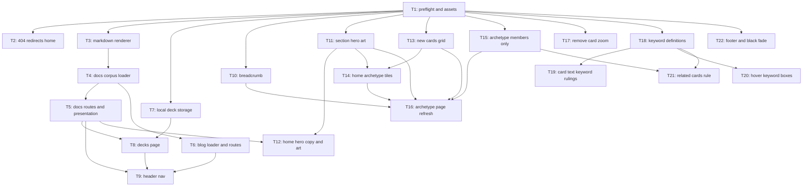

# Plan: website-feedback-pass

## Goal

Ship every item in `.dev/feedback.md` on the Astro site under `website/`. Home page, card page, archetype page, footer, card hover, page transition get reworked; three new route trees (`/docs/`, `/blog/`, `/decks/`) get built because the new header buttons point at them. Success = each feedback line has a landing ticket, `npm run ci` green after every commit, no broken internal link.

## Scope

- In: `website/**` (Astro pages, components, styles, content build scripts, content registries), `docs/**` (new `PRESENTATION.md`, keyword definitions, ADRs), `website/public/art/**` (HD hero art), `WEBSITE_V2_SPEC.md` (drop the superseded welcome-page section).
- In: new route trees `/docs/`, `/blog/`, `/decks/` — minimum viable versions that satisfy the header buttons.
- Out: MSE card source under `cards_mse/` (never written by the website), print pipeline `.script/`, launcher, `MSE/`.
- Out: full WEBSITE_V2_SPEC Phase 1–6 (keyword index pages `/keywords/`, search page `/search/`, published decks `/decks/<slug>/`, release hub `/releases/`, print basket). Only the parts the feedback needs.
- Out: rewriting `/rules/` and `/philosophy/` into curated landings (spec §1.1.4). They stay as-is, just leave the header.

## Assumptions

Caller ran autonomous. Every ambiguity below resolved to the safest in-scope default.

1. **"Presentation page is first page of documentation"** → `/docs/` index renders a new authored `docs/PRESENTATION.md`. Docs corpus = every `docs/**/*.md` except `docs/ADR/**` (decision evidence stays internal).
2. **Blog** → plain Markdown posts under `website/content/blog/<yyyy-mm-dd-slug>/index.md`. No `@astrojs/mdx` (spec §2.1 deferred): a new dependency plus MDX components is out of proportion for one migrated post and risks the locked CSP. Recorded in ADR 0017.
3. **Decks** → `/decks/` is the browser-local decklist manager from spec §5.4 (`essentia.v1.decks`), single page, no published-deck routes. It is the documented exception to the zero-JS baseline; it renders a static explanation without JS.
4. **"HD upscale of original image"** → source is the Konami illustration in `original_images/` (624×624 crop, 2.6× the thumb tier the tiles use today), converted once with `sharp` to webp at native size and committed under `website/public/art/`. No generative service, no API key, no network in any ticket or in the build. The owner supplies a true HD upscale later by overwriting the same path; no validator asserts dimensions, so that swap touches no code. Recorded in ADR 0018.
5. **Keyword rule text** → definitions authored in `website/content/keywords.json`, not parsed out of `docs/keywords/*.md`: only 16 of 73 registry terms have a machine-locatable definition block today. Each entry carries a `doc` back-reference so docs stay the narrative source. Recorded in ADR 0015.
6. **"essentia specific keyword"** (card hover) → keyword registry gains `origin: 'magic' | 'essentia'`; only `essentia` keywords get a hover ruling box. Magic evergreens (Flying, Trample, …) do not.
7. **"Archetypes only contains card with archetype name or explicitly linked"** → section membership becomes `role === 'member' || linked === true`. All 14 current `role: support` cards default to `linked: false` and move to the non-archetype section. They still surface through the new related-cards rule. Recorded in ADR 0016.
8. **"remove welcome page or first time page"** → none exists in `website/src/pages/`. The ticket instead deletes WEBSITE_V2_SPEC §2.3 (planned welcome page + `essentia.v1.visited` redirect + "nav Home points to /releases/") so it is never built.
9. **Nekroz date incoherence** → root cause is `CardGallery.astro` grouping by MSE `card.modified` (2026-08-03) while the header prints `section.latestModified` (release date 2026-08-01). Removing date grouping (feedback Archetype #2) removes the incoherence; a unit test pins `latestModified` to the release lock-in.
10. **"Remove view full size card button and feature"** → also drops the now-unreferenced `zoom` image tier from the build, saving 50 unused 1500px renders.
11. **Wrong URL → home** → `dist/404.html` becomes a meta-refresh redirect to the site base (GitHub Pages serves it for unknown paths). Recorded in ADR 0019.
12. **Playwright e2e** cannot run on this host (recorded in repo history). Every ticket's gate is deterministic Node/vitest/build-time checks. `npm run test:e2e` stays best-effort.
13. **No human step in the whole plan.** `npm install` already ran in `website/` (2026-08-07, `up to date`, 469 packages, Node `v24.18.0`), and all five source illustrations are committed. T1 is a pure preflight gate over those facts, not a hand-off.

## Ticket flowchart

## Ticket order

| ID  | Title | Depends | Commit outcome | File |
| --- | ----- | ------- | -------------- | ---- |
| T1  | Preflight and asset gate | — | `npm run preflight` reports Node, deps and the five source illustrations | `PLAN_2026_08_07_website-feedback-pass/T1_preflight-and-env.md` |
| T2  | Unknown route redirects home | T1 | any unknown URL lands on `/` | `PLAN_2026_08_07_website-feedback-pass/T2_route-404-redirect-home.md` |
| T3  | Markdown renderer extension | T1 | renderer handles headings, lists, tables, code, quotes | `PLAN_2026_08_07_website-feedback-pass/T3_markdown-renderer-extension.md` |
| T4  | Docs corpus loader | T3 | catalog carries every `docs/**/*.md` with rewritten links | `PLAN_2026_08_07_website-feedback-pass/T4_docs-corpus-loader.md` |
| T5  | Docs routes + presentation page | T4 | `/docs/` presents the project; every doc has a page | `PLAN_2026_08_07_website-feedback-pass/T5_docs-routes-and-presentation.md` |
| T6  | Blog loader and routes | T3, T4 | `/blog/` lists posts; first post migrated | `PLAN_2026_08_07_website-feedback-pass/T6_blog-loader-and-routes.md` |
| T7  | Local deck storage | T1 | deck CRUD library with 2-copy clamp and migration | `PLAN_2026_08_07_website-feedback-pass/T7_local-deck-storage.md` |
| T8  | Decks page | T7, T5 | `/decks/` creates, edits, deletes browser-local decklists | `PLAN_2026_08_07_website-feedback-pass/T8_decks-page.md` |
| T9  | Header nav three buttons | T5, T6, T8 | header shows Learn about Essentia / Blog / Decks | `PLAN_2026_08_07_website-feedback-pass/T9_header-nav-three-buttons.md` |
| T10 | Site-wide breadcrumb | T1 | every non-home page shows a left-aligned breadcrumb | `PLAN_2026_08_07_website-feedback-pass/T10_breadcrumb-component.md` |
| T11 | Iconic section hero art | T1 | five committed hero images wired into sections | `PLAN_2026_08_07_website-feedback-pass/T11_iconic-hd-art.md` |
| T12 | Home hero copy and art | T11, T5 | hero shows Trishula art and the new copy | `PLAN_2026_08_07_website-feedback-pass/T12_home-hero-copy-and-art.md` |
| T13 | Home new-cards grid | T1 | 15 new cards in a 3×5 grid + view-all link | `PLAN_2026_08_07_website-feedback-pass/T13_new-cards-grid.md` |
| T14 | Home archetype tiles | T11, T13 | Archetypes heading, hover border, NEW badge | `PLAN_2026_08_07_website-feedback-pass/T14_home-archetype-tiles.md` |
| T15 | Archetype members only | T1 | archetype sections drop unlinked support cards | `PLAN_2026_08_07_website-feedback-pass/T15_archetype-members-only.md` |
| T16 | Archetype page refresh | T10, T11, T13, T14, T15 | alphabetical gallery, NEW badges, no date sections | `PLAN_2026_08_07_website-feedback-pass/T16_archetype-page-refresh.md` |
| T17 | Remove card zoom | T1 | full-size viewer and zoom tier gone | `PLAN_2026_08_07_website-feedback-pass/T17_remove-card-zoom.md` |
| T18 | Keyword definitions registry | T1 | all 73 keywords carry definition, origin, doc | `PLAN_2026_08_07_website-feedback-pass/T18_keyword-definitions-registry.md` |
| T19 | Card text keyword rulings | T18 | card rules text prints keyword rulings inline | `PLAN_2026_08_07_website-feedback-pass/T19_card-text-keyword-rulings.md` |
| T20 | Hover keyword boxes | T18 | hover preview lists Essentia keyword rulings | `PLAN_2026_08_07_website-feedback-pass/T20_card-hover-keyword-boxes.md` |
| T21 | Related cards rule | T15, T18 | related list spans archetype and archetype keywords | `PLAN_2026_08_07_website-feedback-pass/T21_related-cards-rule.md` |
| T22 | Footer line and black fade | T1 | legal line is small and last; transitions fade black | `PLAN_2026_08_07_website-feedback-pass/T22_footer-and-black-transition.md` |

## Feedback coverage

| Feedback | Ticket |
| --- | --- |
| Home 1 (hero = Trishula, HD) | T11, T12 |
| Home 2 (hero headline) | T12 |
| Home 3 (hero subcopy) | T12 |
| Home 4 (wrong url → `/`) | T2 |
| Home 5 (Learn about Essentia CTA) | T5, T12 |
| Home 6 (3 header buttons) | T5, T6, T8, T9 |
| Home 7 (no welcome page) | T12 |
| Home 8 (3×5 new cards + view all) | T13 |
| Home 9 (heading → Archetypes) | T14 |
| Home 10 (tile art = HD iconic) | T11, T14 |
| Home 11 (tile hover border) | T14 |
| Home 12 (tile NEW badge) | T13, T14 |
| Cards 1 (remove full size) | T17 |
| Cards 2 (keyword rule text) | T18, T19 |
| Cards 3 (related cards) | T15, T21 |
| Archetype 1 (HD illustration) | T11, T16 |
| Archetype 2 (alphabetical + NEW, no dates) | T13, T16 |
| Archetype 3 (breadcrumb, site-wide) | T10, T16 |
| Archetype 4 (members only) | T15 |
| Archetype 5 (latest date coherence) | T16 |
| Footer | T22 |
| Card hover keyword boxes | T18, T20 |
| Page transition black fade | T22 |

## Tickets

- [T1: Preflight and asset gate](PLAN_2026_08_07_website-feedback-pass/T1_preflight-and-env.md) — depends: none
- [T2: Unknown route redirects home](PLAN_2026_08_07_website-feedback-pass/T2_route-404-redirect-home.md) — depends: T1
- [T3: Markdown renderer extension](PLAN_2026_08_07_website-feedback-pass/T3_markdown-renderer-extension.md) — depends: T1
- [T4: Docs corpus loader](PLAN_2026_08_07_website-feedback-pass/T4_docs-corpus-loader.md) — depends: T3
- [T5: Docs routes + presentation page](PLAN_2026_08_07_website-feedback-pass/T5_docs-routes-and-presentation.md) — depends: T4
- [T6: Blog loader and routes](PLAN_2026_08_07_website-feedback-pass/T6_blog-loader-and-routes.md) — depends: T3, T4
- [T7: Local deck storage](PLAN_2026_08_07_website-feedback-pass/T7_local-deck-storage.md) — depends: T1
- [T8: Decks page](PLAN_2026_08_07_website-feedback-pass/T8_decks-page.md) — depends: T7, T5
- [T9: Header nav three buttons](PLAN_2026_08_07_website-feedback-pass/T9_header-nav-three-buttons.md) — depends: T5, T6, T8
- [T10: Site-wide breadcrumb](PLAN_2026_08_07_website-feedback-pass/T10_breadcrumb-component.md) — depends: T1
- [T11: Iconic section hero art](PLAN_2026_08_07_website-feedback-pass/T11_iconic-hd-art.md) — depends: T1
- [T12: Home hero copy and art](PLAN_2026_08_07_website-feedback-pass/T12_home-hero-copy-and-art.md) — depends: T11, T5
- [T13: Home new-cards grid](PLAN_2026_08_07_website-feedback-pass/T13_new-cards-grid.md) — depends: T1
- [T14: Home archetype tiles](PLAN_2026_08_07_website-feedback-pass/T14_home-archetype-tiles.md) — depends: T11, T13
- [T15: Archetype members only](PLAN_2026_08_07_website-feedback-pass/T15_archetype-members-only.md) — depends: T1
- [T16: Archetype page refresh](PLAN_2026_08_07_website-feedback-pass/T16_archetype-page-refresh.md) — depends: T10, T11, T13, T14, T15
- [T17: Remove card zoom](PLAN_2026_08_07_website-feedback-pass/T17_remove-card-zoom.md) — depends: T1
- [T18: Keyword definitions registry](PLAN_2026_08_07_website-feedback-pass/T18_keyword-definitions-registry.md) — depends: T1
- [T19: Card text keyword rulings](PLAN_2026_08_07_website-feedback-pass/T19_card-text-keyword-rulings.md) — depends: T18
- [T20: Hover keyword boxes](PLAN_2026_08_07_website-feedback-pass/T20_card-hover-keyword-boxes.md) — depends: T18
- [T21: Related cards rule](PLAN_2026_08_07_website-feedback-pass/T21_related-cards-rule.md) — depends: T15, T18
- [T22: Footer line and black fade](PLAN_2026_08_07_website-feedback-pass/T22_footer-and-black-transition.md) — depends: T1

## Reference docs

- Existing spec: `WEBSITE_V2_SPEC.md` (phases this plan partially lands: 1.1, 2.2, 5.4)
- ADRs written with this plan: `docs/ADR/proposed/0015`–`0019`
- Architecture doc: `docs/website-information-architecture.html`
