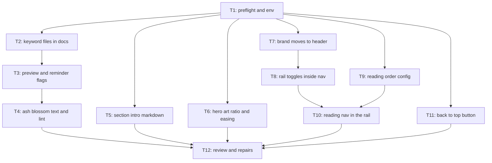

# Plan: Website feedback pass 2

## Goal

Move keyword rulings out of `website/content/keywords.json` into one editable
`docs/keywords/{id}.md` per keyword, fix the Ash Blossom card text + its hover /
reminder rulings, rewrite the three section intros from editable markdown, resize
and slow the archetype hero art, move the brand into the header, put the rail
toggles inside the nav (top + bottom, visible when collapsed), migrate the docs /
blog reading rail into the nav behind an editable order config, and add a
back-to-top button. Success: every feedback line lands, `npm run ci`,
`npm run test:e2e`, `python -m unittest discover -s tests`,
`python .script/lint_mse_card_style.py` and
`python .script/release_package.py validate` are green.

## Scope

- In: `website/` (content loaders, catalog schema, layout, nav, styles, tests),
  `docs/keywords/`, `docs/KEYWORDS.md`, `docs/ADR/`, `website/content/`,
  `cards_mse/01_alpha/LOTA-0001-Alpha_0.1/` (Ash Blossom rule text only),
  `.script/lint_mse_card_style.py` (one enumeration exemption).
- Out: card art / renders regeneration beyond the one `rebuild` run, MSE styles,
  new archetypes, deck manager, Find palette, print tooling, `blog/` post bodies,
  any card other than Ash Blossom & Joyous Spring.

## Assumptions

- `graphify` CLI is not installed on this machine (`graphify: No such file or
  directory`). The mandatory-graphify hook cannot be honoured; direct file reads
  and grep are used instead. Tickets do not call `graphify update .`.
- Plan artefacts live under `ai-artifacts/` (repo convention), not `ai_artefacts/`.
- Per-keyword files live at `docs/keywords/{id}.md` with the id kept from the
  current registry (`mill-n`, `on-enter`, `abyssal-curse`, …). Rule that keeps the
  docs corpus intact: **lower-case kebab `.md` in `docs/keywords/` = keyword
  definition (never published as a doc page); UPPER_CASE `.md` = module doc**.
- The four module docs (`ACTIONS.md`, `EVENTS.md`, `ABILITIES.md`,
  `COSTS_AND_PROCEDURES.md`) stay and keep narrating the taxonomy. The per-keyword
  file becomes the source of record for the *website ruling text*; the `doc:` key
  keeps pointing at the owning module for provenance.
- Two explicit per-keyword booleans replace the derived behaviour:
  `preview` (show in the gallery hover ruling box, was `origin === 'essentia'`) and
  `reminder` (append `(ruling)` after the bold phrase in card rule text, was
  always true). Migration keeps today's values, then flips exactly two:
  `mill-n.preview = true`, `counter.reminder = false`. Nothing else changes.
- `Draw` stays `reminder: true` — the user only asked for `Counter` to lose its
  explanation text.
- Section intro prose lives in `website/content/section-intros/{slug}.md`
  (mirrors the existing `website/content/explanations/` pattern) because the
  Nekroz replacement text is multi-paragraph with a bullet list, which
  `introFromDoc()` cannot carry. `section.intro` (plain, ≤360 chars, used for SEO
  and `<meta description>`) is derived from that file's first paragraph.
- `catalog-hero-art` becomes `aspect-ratio: 1 / 1` — the hero sources
  (`website/public/art/*-hero.webp`) are square, so that is "same ratio as the
  original card image". Exact pixel parity of `.catalog-hero` height is **not**
  asserted: the art grows, the hero's own vertical padding shrinks to absorb it.
- The back-to-top button ships in `BaseLayout.astro`, so it appears on every page,
  not only docs / blog. Strict superset of the request, one implementation.
- Ash Blossom renders (`renders/*.png`) are regenerated by
  `python .script/release_package.py rebuild …`, which drives the native
  `MSE/bin/magicseteditor` binary — verified runnable in T1.

## Ticket flowchart

## Ticket order

| ID  | Title                          | Depends | Commit outcome                                                                  | File                                                                     |
| --- | ------------------------------ | ------- | ------------------------------------------------------------------------------- | ------------------------------------------------------------------------ |
| T1  | Preflight and env              | —       | Baseline verified green; MSE render toolchain confirmed runnable                  | `PLAN_2026_08_08_website-feedback-pass-2/T1_preflight-and-env.md`          |
| T2  | Keyword files in docs          | T1      | Rulings load from `docs/keywords/{id}.md`; `content/keywords.json` deleted         | `PLAN_2026_08_08_website-feedback-pass-2/T2_keyword-files-in-docs.md`      |
| T3  | Preview and reminder flags     | T2      | Mill N shows in hover box; Counter loses its card-text reminder                    | `PLAN_2026_08_08_website-feedback-pass-2/T3_preview-and-reminder-flags.md` |
| T4  | Ash Blossom text and lint      | T3      | Card text reads `(Draw, Mill X, Search, etc.)` with bold actions; package rebuilt   | `PLAN_2026_08_08_website-feedback-pass-2/T4_ash-blossom-text-and-lint.md`  |
| T5  | Section intro markdown         | T1      | Non-archetype / Nekroz / Burning Abyss intros come from editable markdown           | `PLAN_2026_08_08_website-feedback-pass-2/T5_section-intro-markdown.md`     |
| T6  | Hero art ratio and easing      | T1      | `catalog-hero-art` is square, bigger, and un-zooms slowly                          | `PLAN_2026_08_08_website-feedback-pass-2/T6_hero-art-ratio-and-easing.md`  |
| T7  | Brand moves to header          | T1      | Wordmark sits in the header on every width; nav has no text brand                  | `PLAN_2026_08_08_website-feedback-pass-2/T7_brand-moves-to-header.md`      |
| T8  | Rail toggles inside nav        | T7      | Two toggles inside the nav; collapsed rail is a strip that still shows them         | `PLAN_2026_08_08_website-feedback-pass-2/T8_rail-toggles-inside-nav.md`    |
| T9  | Reading order config           | T1      | `website/content/reading-order.json` drives docs groups and blog sections           | `PLAN_2026_08_08_website-feedback-pass-2/T9_reading-order-config.md`       |
| T10 | Reading nav in the rail        | T8, T9  | Docs / blog navigation lives in the left nav; `.reading-rail` is gone               | `PLAN_2026_08_08_website-feedback-pass-2/T10_reading-nav-in-the-rail.md`   |
| T11 | Back to top button             | T1      | Bottom-right back-to-top button appears once the page is scrolled                   | `PLAN_2026_08_08_website-feedback-pass-2/T11_back-to-top-button.md`        |
| T12 | Review and repairs             | T4, T5, T6, T10, T11 | Whole suite green; docs and ADRs truthful                              | `PLAN_2026_08_08_website-feedback-pass-2/T12_review-repairs.md`            |

## Tickets

- [T1: Preflight and env](PLAN_2026_08_08_website-feedback-pass-2/T1_preflight-and-env.md) — depends: none
- [T2: Keyword files in docs](PLAN_2026_08_08_website-feedback-pass-2/T2_keyword-files-in-docs.md) — depends: T1
- [T3: Preview and reminder flags](PLAN_2026_08_08_website-feedback-pass-2/T3_preview-and-reminder-flags.md) — depends: T2
- [T4: Ash Blossom text and lint](PLAN_2026_08_08_website-feedback-pass-2/T4_ash-blossom-text-and-lint.md) — depends: T3
- [T5: Section intro markdown](PLAN_2026_08_08_website-feedback-pass-2/T5_section-intro-markdown.md) — depends: T1
- [T6: Hero art ratio and easing](PLAN_2026_08_08_website-feedback-pass-2/T6_hero-art-ratio-and-easing.md) — depends: T1
- [T7: Brand moves to header](PLAN_2026_08_08_website-feedback-pass-2/T7_brand-moves-to-header.md) — depends: T1
- [T8: Rail toggles inside nav](PLAN_2026_08_08_website-feedback-pass-2/T8_rail-toggles-inside-nav.md) — depends: T7
- [T9: Reading order config](PLAN_2026_08_08_website-feedback-pass-2/T9_reading-order-config.md) — depends: T1
- [T10: Reading nav in the rail](PLAN_2026_08_08_website-feedback-pass-2/T10_reading-nav-in-the-rail.md) — depends: T8, T9
- [T11: Back to top button](PLAN_2026_08_08_website-feedback-pass-2/T11_back-to-top-button.md) — depends: T1
- [T12: Review and repairs](PLAN_2026_08_08_website-feedback-pass-2/T12_review-repairs.md) — depends: T4, T5, T6, T10, T11

## Records written with this plan

- `docs/ADR/proposed/0023-keyword-rulings-in-per-keyword-docs.md`
- `docs/ADR/proposed/0024-section-intro-prose-in-content.md`
- `docs/ADR/proposed/0025-catalog-rail-owns-reading-navigation.md`
- `docs/ADR/proposed/0026-reading-order-config.md`
- `docs/keyword-pipeline.html` (new, written with this plan)
- `docs/ADR/README.md` (proposed index extended with 0020–0026)
- `docs/website-information-architecture.html` (updated by T12, once the shipped
  navigation model is real)
