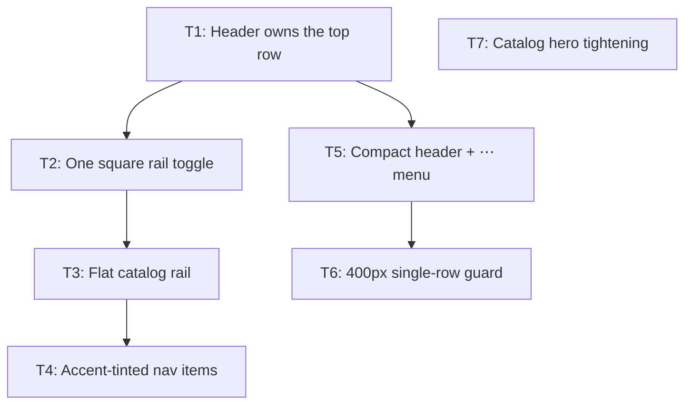

# Plan: Website header and rail pass

## Goal

Make the site header the top-priority full-width menubar, dock the catalog rail
under it, flatten and colour-code the rail, compact the header at phone widths
behind a `⋯` overflow menu, and tighten the archetype catalog hero. Success:
every line of `feedback.md` lands, and `cd website && npm run ci` +
`npm run test:e2e` are green.

## Scope

**Amended 2026-08-09, after the T1–T7 review fanout.** The Goal above promises
"every line of `feedback.md` lands", but the original Scope In covered only the
`## Header Menubar and Header` and `## /archetypes` sections. The `## "New" Badge`
and `## Card preview ruling text` sections were dropped silently. T9 and T12 close
that gap; T8, T10, T11 and T13 close the defects the reviewers confirmed. Scope In
therefore also covers `website/src/styles/global.css` (`.tile-badge`),
`docs/keywords/`, the keyword→card-preview path, `website/tests/support/css.ts`,
`website/shared/header-row.mjs`, `website/scripts/harden-csp.mjs` and
`website/scripts/scan-dist.mjs`.

- In: `website/src/layouts/BaseLayout.astro`, `website/src/components/Navigation.svelte`,
  `website/src/components/FindPalette.svelte`, `website/src/styles/global.css`,
  `website/scripts/check-header-row.mjs` (new), `website/shared/header-row.mjs` (new),
  `website/package.json` (build chain), `website/tests/unit/*`, `website/tests/e2e/*`,
  `website/DESIGN.md`, `docs/ADR/proposed/0027…0029`, `docs/website-shell-chrome.html`.
- Out: card data (`cards_mse/`), renders, MSE tooling, Python suites, content
  pipeline (`website/scripts/content/`), Find palette search behaviour, deck
  manager, blog/doc prose, route structure, new archetypes, colour token values
  (`--ember`, `--ice`, … stay as authored).

## Assumptions

- Plan artefacts live under `ai-artifacts/` (repo convention), not `ai_artefacts/`.
  ADRs follow the repo shape `docs/ADR/proposed/00NN-slug.md`, not `XXX_ADR_{title}.md`.
- "Mobile size" for the compact header = the existing phone breakpoint
  `@media (max-width: 44rem)` (704px), which is already where the wordmark swaps
  for the letter mark. 400px is the **narrowest supported** width, and is the
  width the single-row guard is measured at.
- "Nav drawer" in feedback lines 1–7 means the desktop left rail
  `nav#desktop-catalog` (`.desktop-catalog`). Line 5 (flatten the groups) is
  mirrored into the `<dialog class="mobile-drawer">` so both navigations offer
  the same list — the drawer is the only navigation below 64rem.
- Feedback line 2 ("remove top button to collapse") = delete
  `.rail-toggle--top`. The mobile drawer's `×` close button stays: it closes a
  modal dialog, it is not a rail collapse control.
- Feedback line 6 non-archetype colour: `non-archetype` is `kind:
  'non-archetype'` and gets **no** tint (its authored `accent: relic` is ignored
  for the rail tint), so it renders on the rail's own near-black surface.
  Burning Abyss `accent: ember` (orange) and Nekroz `accent: ice` (blue) already
  match the feedback, so no token is re-authored.
- Feedback line 8.5 ("do not error but show warning"): a wrapped header is a
  **warning**, never a build failure — `website/scripts/check-header-row.mjs`
  warns and exits 0, and an inline `console.warn` fires in the browser. The
  Playwright test that asserts a single row is a normal red/green test.
- The `⋯` overflow menu uses the native HTML `popover` attribute — no JS, no new
  island, and it survives the page CSP (`script-src 'self' 'unsafe-inline'`).
- `<Navigation>` moves **inside** `<header class="site-header">` so the hamburger
  is a real header flex item and the brand can hold the true top-left corner.
  Astro ships `astro-island{display:contents}`, so the island wrapper is
  transparent to flex layout — `FindPalette` already proves this shape.
- Feedback line 9.1 ("more centered") is delivered as a narrower hero row
  (`width: min(100%, 72rem); margin-inline: auto`) plus a smaller column gap.
  Both column sizes are unchanged, per "Keep their current size".
- Feedback line 9.2 ("remove hero image on mobile ()") — the unstated width is
  read as the phone breakpoint `44rem`, matching the rest of this pass.
- `/archetypes` has no index route; the hero lives on `/archetypes/{slug}/` and
  `/sections/non-archetype/{slug}/`, which share `.catalog-hero`. Both change.

## Ticket flowchart

## Ticket order

| ID  | Title                                | Depends | Commit outcome                                                                                 | File                                                                                |
| --- | ------------------------------------ | ------- | ---------------------------------------------------------------------------------------------- | ----------------------------------------------------------------------------------- |
| T1  | Header owns the top row              | —       | Header spans the full viewport width above the rail; brand is the top-left corner at every width | `PLAN_2026_08_09_website-header-and-rail-pass/T1_header-owns-top-row.md`              |
| T2  | One square rail toggle               | T1      | The rail has a single collapse control: a small square at its bottom-right corner                | `PLAN_2026_08_09_website-header-and-rail-pass/T2_single-square-rail-toggle.md`        |
| T3  | Flat catalog rail                    | T2      | The rail and drawer list every section in one flat list, no group heading, no group toggle       | `PLAN_2026_08_09_website-header-and-rail-pass/T3_flat-catalog-rail.md`                |
| T4  | Accent-tinted nav items              | T3      | Each archetype nav item carries a faint tint of its accent that intensifies on hover             | `PLAN_2026_08_09_website-header-and-rail-pass/T4_accent-tinted-nav-items.md`          |
| T5  | Compact header + ⋯ menu              | T1      | At ≤44rem the header shows icons only and folds the three section links into a `⋯` popover       | `PLAN_2026_08_09_website-header-and-rail-pass/T5_compact-header-overflow-menu.md`     |
| T6  | 400px single-row guard               | T5      | A wrapped header at ≤400px warns at build time and in the console; an e2e test pins one row      | `PLAN_2026_08_09_website-header-and-rail-pass/T6_header-single-row-guard.md`          |
| T7  | Catalog hero tightening              | —       | The archetype hero row is narrower and centred; the hero art is gone on phones                   | `PLAN_2026_08_09_website-header-and-rail-pass/T7_catalog-hero-tightening.md`          |
| T8  | CI-green + CSP truth                 | T1–T7   | `npm run test:e2e` exits 0 and no CSP-blocked markup ships                                        | `PLAN_2026_08_09_website-header-and-rail-pass/T8_ci-green-and-csp-truth.md`           |
| T9  | "New" badge position                 | —       | The New badge sits on the artwork instead of over the mana cost                                   | `PLAN_2026_08_09_website-header-and-rail-pass/T9_new-badge-position.md`               |
| T10 | Catalog hero fidelity                | T7      | Hero art hides with the single-column switch; both columns keep their size                        | `PLAN_2026_08_09_website-header-and-rail-pass/T10_hero-fidelity.md`                   |
| T11 | Staged header degradation            | T5, T6  | The header sheds width in the three ordered stages feedback 8.6 specifies                          | `PLAN_2026_08_09_website-header-and-rail-pass/T11_staged-header-degradation.md`       |
| T12 | Eight ruling keywords                | —       | The eight authored ruling keywords exist in docs and show in card preview                          | `PLAN_2026_08_09_website-header-and-rail-pass/T12_ruling-keywords.md`                 |
| T13 | Give the guards teeth                | T8      | Each new guard fails when the regression it protects against is present                            | `PLAN_2026_08_09_website-header-and-rail-pass/T13_give-the-guards-teeth.md`           |

## Tickets

- [T1: Header owns the top row](PLAN_2026_08_09_website-header-and-rail-pass/T1_header-owns-top-row.md) — depends: none
- [T2: One square rail toggle](PLAN_2026_08_09_website-header-and-rail-pass/T2_single-square-rail-toggle.md) — depends: T1
- [T3: Flat catalog rail](PLAN_2026_08_09_website-header-and-rail-pass/T3_flat-catalog-rail.md) — depends: T2
- [T4: Accent-tinted nav items](PLAN_2026_08_09_website-header-and-rail-pass/T4_accent-tinted-nav-items.md) — depends: T3
- [T5: Compact header + ⋯ menu](PLAN_2026_08_09_website-header-and-rail-pass/T5_compact-header-overflow-menu.md) — depends: T1
- [T6: 400px single-row guard](PLAN_2026_08_09_website-header-and-rail-pass/T6_header-single-row-guard.md) — depends: T5
- [T7: Catalog hero tightening](PLAN_2026_08_09_website-header-and-rail-pass/T7_catalog-hero-tightening.md) — depends: none
- [T8: CI-green + CSP truth](PLAN_2026_08_09_website-header-and-rail-pass/T8_ci-green-and-csp-truth.md) — depends: T1–T7
- [T9: "New" badge position](PLAN_2026_08_09_website-header-and-rail-pass/T9_new-badge-position.md) — depends: none
- [T10: Catalog hero fidelity](PLAN_2026_08_09_website-header-and-rail-pass/T10_hero-fidelity.md) — depends: T7
- [T11: Staged header degradation](PLAN_2026_08_09_website-header-and-rail-pass/T11_staged-header-degradation.md) — depends: T5, T6
- [T12: Eight ruling keywords](PLAN_2026_08_09_website-header-and-rail-pass/T12_ruling-keywords.md) — depends: none
- [T13: Give the guards teeth](PLAN_2026_08_09_website-header-and-rail-pass/T13_give-the-guards-teeth.md) — depends: T8
