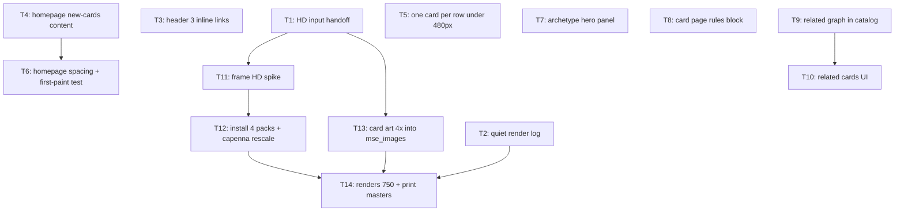

# Plan: feedback batch (13 items)

## Goal

Execute `feedback.md` items 1-13. Phase A: 11 site + tooling items, ships now.
Phase B: every MSE frame plus 177 card-art updates (four user-accepted skips),
renders 750×1046, real print masters at 1500×2092. Success = 13 items done,
`npm run ci` + `npm run test:e2e` +
`python -m unittest discover -s tests` green, `draftResolution` false.

## Final status

Shipped on `plan/feedback-batch`: 13 items landed. Art scope is 177 updated + four
user-accepted permanent skips (`Absolute King Back Jack`, `Crane Crane`, `Fiend
Griefing`, `Fiendish Rhino Warrior`). AronGomu approved exact 50 display-render +
50 print-master hashes on 2026-08-10. Manual MSE/browser 1920px sharpness checks
remain pending. Automated E2E covers Chromium + WebKit; Firefox cannot launch in
current NixOS environment.

## Scope

- In: `website/` (Astro pages, CSS, content build, tests), `.script/` render +
  lifecycle tooling, `MSE/` vendored frames, `cards_mse/` open alpha package art,
  `docs/ADR/proposed/`, `docs/*.html`.
- Out: locked packages (stay frozen at SD renders), non-archetype section page hero,
  new homepage layouts, keyword ruling text edits, card design changes.

## Assumptions

- Item 11 = delete paragraph `Latest cards from alpha/beta/release packages.`
- "Dex" = existing `Decks` link. Label unchanged.
- "HD screen" = 1920×1080, default zoom.
- Capenna 744→750 rescale scales style coordinates by 750/744; bitmaps resize to
  750×1047 then crop only bottom row, ending exact 750×1046.
- Category-2 build failure fires on 2 tokens only: quoted archetype name matching no
  `namePattern`, and `MV` not followed by integer or `X`. Zero-match reference = legal.
- Rules block sits after card facts, before `Design notes`.
- Interaction category has no listing page → truncation shows count, not link.
- TODO(user) in T1: name of upscaler that made `original_images_hd/`, plus 173 files.

## Ticket flowchart

## Ticket order

| ID  | Title | Depends | Commit outcome | File |
| --- | ----- | ------- | -------------- | ---- |
| T1  | HD input hand-off + verifier | — | `verify_hd_inputs.py` reports what HD assets exist and what is missing | `PLAN_2026_08_10_feedback_batch/T1_hd-input-handoff.md` |
| T2  | Quiet render log + `--verbose` | — | `npm run dev` prints one line per package | `PLAN_2026_08_10_feedback_batch/T2_quiet-render-log.md` |
| T3  | Header: 3 inline links, no `⋯` | — | Learn/Blog/Decks inline at 400px, popover gone | `PLAN_2026_08_10_feedback_batch/T3_header-inline-links.md` |
| T4  | Homepage new-cards content | — | 10 cards, no blurb, big CTA, renamed hero button | `PLAN_2026_08_10_feedback_batch/T4_home-new-cards-content.md` |
| T5  | One card per row under 480px | — | new-cards grid 1-up at 400px | `PLAN_2026_08_10_feedback_batch/T5_one-card-per-row.md` |
| T6  | Homepage spacing + first-paint test | T4 | `New cards` heading in view at 1920×1080 on load | `PLAN_2026_08_10_feedback_batch/T6_home-spacing-first-paint.md` |
| T7  | Archetype hero panel | — | archetype title + intro on a bordered translucent panel | `PLAN_2026_08_10_feedback_batch/T7_archetype-hero-panel.md` |
| T8  | Card page rules block | — | rule text verbatim, rulings in their own block | `PLAN_2026_08_10_feedback_batch/T8_card-rules-block.md` |
| T9  | Related graph in catalog | — | every card carries archetype + interaction id lists | `PLAN_2026_08_10_feedback_batch/T9_related-graph.md` |
| T10 | Related cards UI | T9 | two headed thumbnail grids on the card page | `PLAN_2026_08_10_feedback_batch/T10_related-cards-ui.md` |
| T11 | Frame HD spike | T1 | measured verdict + ADR 0030 filled in | `PLAN_2026_08_10_feedback_batch/T11_frame-hd-spike.md` |
| T12 | Install 4 HD packs + capenna rescale | T11 | every frame 750×1046, manifest re-pinned | `PLAN_2026_08_10_feedback_batch/T12_install-hd-frames.md` |
| T13 | Card art 4× into `mse_images/` | T1 | all 50 alpha cards carry 4× art | `PLAN_2026_08_10_feedback_batch/T13_hd-card-art.md` |
| T14 | Renders 750 + print masters on | T2, T12, T13 | `draftResolution` false, web display tier really 750 | `PLAN_2026_08_10_feedback_batch/T14_hd-renders-and-print.md` |

## Tickets

- [T1: HD input hand-off + verifier](PLAN_2026_08_10_feedback_batch/T1_hd-input-handoff.md) — depends: none
- [T2: Quiet render log + `--verbose`](PLAN_2026_08_10_feedback_batch/T2_quiet-render-log.md) — depends: none
- [T3: Header 3 inline links](PLAN_2026_08_10_feedback_batch/T3_header-inline-links.md) — depends: none
- [T4: Homepage new-cards content](PLAN_2026_08_10_feedback_batch/T4_home-new-cards-content.md) — depends: none
- [T5: One card per row under 480px](PLAN_2026_08_10_feedback_batch/T5_one-card-per-row.md) — depends: none
- [T6: Homepage spacing + first-paint test](PLAN_2026_08_10_feedback_batch/T6_home-spacing-first-paint.md) — depends: T4
- [T7: Archetype hero panel](PLAN_2026_08_10_feedback_batch/T7_archetype-hero-panel.md) — depends: none
- [T8: Card page rules block](PLAN_2026_08_10_feedback_batch/T8_card-rules-block.md) — depends: none
- [T9: Related graph in catalog](PLAN_2026_08_10_feedback_batch/T9_related-graph.md) — depends: none
- [T10: Related cards UI](PLAN_2026_08_10_feedback_batch/T10_related-cards-ui.md) — depends: T9
- [T11: Frame HD spike](PLAN_2026_08_10_feedback_batch/T11_frame-hd-spike.md) — depends: T1
- [T12: Install 4 HD packs + capenna rescale](PLAN_2026_08_10_feedback_batch/T12_install-hd-frames.md) — depends: T11
- [T13: Card art 4× into `mse_images/`](PLAN_2026_08_10_feedback_batch/T13_hd-card-art.md) — depends: T1
- [T14: Renders 750 + print masters on](PLAN_2026_08_10_feedback_batch/T14_hd-renders-and-print.md) — depends: T2, T12, T13

## Feedback item → ticket

| Item | Ticket |
| --- | --- |
| 1 archetype panel | T7 |
| 2 dev log | T2 |
| 3 header | T3 |
| 4 one per row | T5 |
| 5 HD templates | T1, T11, T12, T14 |
| 6 HD art | T1, T13 |
| 7 keyword rules | T8 |
| 8 related cards | T9, T10 |
| 9 CTA + 10 cards | T4 |
| 10 archetype heading gap | T6 |
| 11 blurb + margins | T4, T6 |
| 12 hero margin + test | T6 |
| 13 button label | T4 |

## Decision records

- `docs/ADR/proposed/0030-hd-frames-at-750.md` — frame resolution strategy.
- `docs/ADR/proposed/0031-card-page-prints-mse-text.md` — verbatim text + rules block.
- `docs/ADR/proposed/0032-derived-related-cards.md` — related-card derivation.

## Architecture docs

- `docs/render-resolution-pipeline.html` — art → frame → render → web/print chain.
- `docs/related-cards-derivation.html` — vocabularies, clauses, matching, caps.
