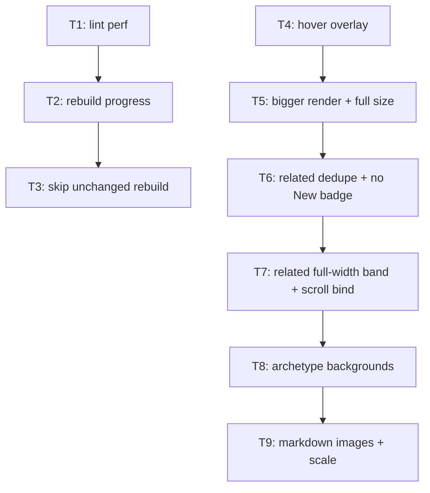

# Plan: feedback batch 2

## Goal

Ship 11 feedback items: kill 25s lint cost + 41s blind rebuild in dev/CI loop, and fix
card-page + hover surfaces on website (overlay preview, bigger render, full-size link,
related-cards dedupe + full-width band, archetype backgrounds, markdown images).
Success = every item observable, tests green (no new failures vs baseline), rebuild
no-op under 1s, lint under 2s.

## Scope

- In: `.script/lint_mse_card_style.py`, `.script/export_mse_renders.py`, `.script/release_package.py`,
  `.script/rebuild_open_packages.py`, `website/src/**`, `website/scripts/content/related.mjs`,
  `website/public/backgrounds/`, `docs/PRESENTATION.md`, tests for each.
- Out: card text redesign, MSE frame/render resolution changes, Rust toolchain, new npm deps,
  print pipeline changes, new tiers in image derivative pipeline, blog authoring.

## Assumptions

- Repo baseline is **red**: `python -m unittest discover -s tests` = 200 tests, **21 failures**
  (MSE self-name italics + `error-spelling` drift, pre-existing on `plan/feedback-batch`),
  `python .script/lint_mse_card_style.py` = **198 findings** (200 stdout lines, exit 1, 25.3s wall;
  parent-measured on the working tree at run start). Every ticket validates
  "no NEW failures / no changed findings", not "all green".
- Card pixels: canonical MSE render = 750×1046, print master = 1500×2092, display webp tier = 750 px.
  No 1920 px source exists. So "full size" (item 4) = print master PNG, and 40rem cap (item 8)
  keeps display tier near 1:1 at DPR 1.
- CSP forbids `style=""` attributes (`harden-csp.mjs` rejects `unsafe-hashes`; dist has 0 style attrs).
  So markdown image scale (item 11) ships as a **class ladder in 5% steps**, not inline style.
- Archetype backgrounds are AI-generated by owner → `content/art-provenance.json` note must be
  amended honestly; they are page decoration, outside `check-rights.mjs` scope (card renders only).
- Rebuild stamp lives outside package tree (`.cache/mse-rebuild/`) because `package_hashes()`
  hashes every package file and would churn on each build.
- Item 3 preview aspect from render: 1046 / 750.

## Ticket flowchart

## Ticket order

| ID  | Title                                     | Depends | Commit outcome                                             | File                                                                    |
| --- | ----------------------------------------- | ------- | ---------------------------------------------------------- | ----------------------------------------------------------------------- |
| T1  | Lint under 2s, same findings              | —       | `lint_mse_card_style.py` 25.6s → <2s, byte-identical output | `PLAN_2026_08_12_feedback_batch_2/T1_lint-perf.md`                       |
| T2  | Rebuild prints phases + per-card progress | T1      | `npm run dev` shows live render/print progress              | `PLAN_2026_08_12_feedback_batch_2/T2_rebuild-progress.md`                |
| T3  | Skip rebuild when MSE unchanged           | T2      | second `rebuild` in a row exits <1s with `unchanged`        | `PLAN_2026_08_12_feedback_batch_2/T3_rebuild-skip-stamp.md`              |
| T4  | Hover preview overlays the card at 75vh   | —       | preview covers hovered tile, ~75vh tall, rulings float      | `PLAN_2026_08_12_feedback_batch_2/T4_hover-overlay.md`                   |
| T5  | Card render fills column + full-size link | T4      | card image up to 40rem, `Show full size` opens print PNG    | `PLAN_2026_08_12_feedback_batch_2/T5_card-render-size-and-full-size.md`  |
| T6  | Related dedupe, no New badge              | T5      | interaction list excludes archetype ids, no badge there     | `PLAN_2026_08_12_feedback_batch_2/T6_related-dedupe-and-badge.md`        |
| T7  | Related band full width under bound pair  | T6      | image+text scroll bound, related band full width below      | `PLAN_2026_08_12_feedback_batch_2/T7_related-band-layout.md`             |
| T8  | Archetype page backgrounds                | T7      | nekroz + burning abyss pages carry dim photo backdrop       | `PLAN_2026_08_12_feedback_batch_2/T8_archetype-backgrounds.md`           |
| T9  | Markdown images with % scale              | T8      | `` renders scaled image in docs + blog    | `PLAN_2026_08_12_feedback_batch_2/T9_markdown-images.md`                 |

## Tickets

- [T1: Lint under 2s, same findings](PLAN_2026_08_12_feedback_batch_2/T1_lint-perf.md) — depends: none
- [T2: Rebuild prints phases + per-card progress](PLAN_2026_08_12_feedback_batch_2/T2_rebuild-progress.md) — depends: T1
- [T3: Skip rebuild when MSE unchanged](PLAN_2026_08_12_feedback_batch_2/T3_rebuild-skip-stamp.md) — depends: T2
- [T4: Hover preview overlays the card at 75vh](PLAN_2026_08_12_feedback_batch_2/T4_hover-overlay.md) — depends: none
- [T5: Card render fills column + full-size link](PLAN_2026_08_12_feedback_batch_2/T5_card-render-size-and-full-size.md) — depends: T4
- [T6: Related dedupe, no New badge](PLAN_2026_08_12_feedback_batch_2/T6_related-dedupe-and-badge.md) — depends: T5
- [T7: Related band full width under bound pair](PLAN_2026_08_12_feedback_batch_2/T7_related-band-layout.md) — depends: T6
- [T8: Archetype page backgrounds](PLAN_2026_08_12_feedback_batch_2/T8_archetype-backgrounds.md) — depends: T7
- [T9: Markdown images with % scale](PLAN_2026_08_12_feedback_batch_2/T9_markdown-images.md) — depends: T8

## Feedback item → ticket map

| Item | Subject                        | Ticket |
| ---- | ------------------------------ | ------ |
| 1    | rebuild progress output        | T2     |
| 2    | card text parsing speed        | T1     |
| 3    | hover preview overlay          | T4     |
| 4    | show full size button          | T5     |
| 5    | no New badge in related        | T6     |
| 6    | related dedupe                 | T6     |
| 7    | related full width + bind      | T7     |
| 8    | bigger card image              | T5     |
| 9    | archetype backgrounds          | T8     |
| 10   | skip rebuild when unchanged    | T3     |
| 11   | markdown images + % scale      | T9     |

## Decision records written with this plan

- `docs/ADR/proposed/0033-lint-precompiled-boundary-patterns.md`
- `docs/ADR/proposed/0034-rebuild-progress-and-stamp.md`
- `docs/ADR/proposed/0035-hover-preview-overlays-the-card.md`
- `docs/ADR/proposed/0036-related-interaction-excludes-archetype.md`
- `docs/ADR/proposed/0037-markdown-images-with-scale-ladder.md`

## Architecture docs written with this plan

- `docs/rebuild-fast-path.html` — lint prefilter, progress protocol, stamp fast path
- `docs/card-detail-surfaces.html` — hover overlay geometry, card page layout, markdown images
