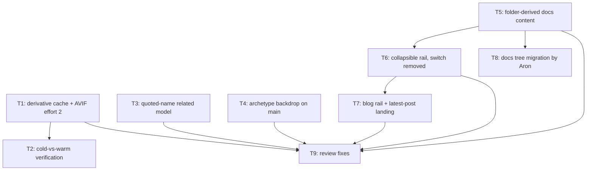

# Plan: feedback batch 3

## Goal

Kill the 109 s website build, replace the quadratic related-card matcher with a linear
quoted-name reference relation, scope the archetype backdrop to the content column,
restructure docs navigation around the `docs/` folder tree, and simplify the blog rail.
Success = warm `npm run dev` under 3 s, `npm run ci` green, every feedback item 1-7 shipped
or formally closed.

## Scope

- In: `website/scripts/content/**`, `website/src/**`, `website/tests/**`,
  `website/package.json`, `docs/ADR/proposed/**`, `docs/*.html`, the `docs/` tree layout
- Out: card data, MSE projects, the Python pipeline, background art generation for
  Shaddoll / Spellbook / non-archetype, parallelising image encoding, hero-panel redesign

## Assumptions

- Item 4 (split blog / docs / cards into separate builds) is **closed by measurement**, not
  implemented: `astro build` is 1.5 s for 152 pages and the whole content build minus image
  writes is 0.66 s. ADR 0039 records this. No `--scope` flag ships.
- Dim + blur are applied through a pseudo-element and a hashed `<style>` block, because
  `scripts/harden-csp.mjs` rejects inline `style` attributes.
- `DD/MM/YYYY` applies to the blog rail only. `formatDate` stays as it is everywhere else.
- Rail entry titles keep coming from each doc's own `#` heading.
- The 12-tile cap on related blocks is retained.
- T8 (the `docs/` tree migration) is executed by Aron. T5 makes the build layout-agnostic
  first, so the migration cannot break a green build whenever he runs it.
- Measured on the live corpus: all 37 quoted names in card rule text are self-references, so
  T3 ships with zero live edges and zero guard failures.

## Ticket flowchart

## Ticket order

| ID  | Title                                     | Depends | Commit outcome                                                              | File                                                              |
| --- | ----------------------------------------- | ------- | --------------------------------------------------------------------------- | ----------------------------------------------------------------- |
| T1  | Content-hash cache for image derivatives  | —       | Warm `npm run content` drops from 107 s to under 3 s; output byte-identical  | `PLAN_2026_08_13_feedback_batch_3/T1_derivative-cache.md`          |
| T2  | Cold-vs-warm derivative verification      | T1      | `npm run cache:verify` proves the cache never serves stale bytes; wired into CI | `PLAN_2026_08_13_feedback_batch_3/T2_cache-verification.md`     |
| T3  | Quoted-name related-card model            | —       | Constraint matcher gone; references + referenced-by ship, linear in card count | `PLAN_2026_08_13_feedback_batch_3/T3_quoted-name-relations.md`   |
| T4  | Archetype backdrop on the content column  | —       | Archetype pages paint a dimmed, blurred photo inside `<main>` only          | `PLAN_2026_08_13_feedback_batch_3/T4_archetype-backdrop.md`        |
| T5  | Folder-derived docs content               | —       | Docs groups, labels and routes derive from the `docs/` tree; reading-order docs config deleted | `PLAN_2026_08_13_feedback_batch_3/T5_docs-from-folders.md` |
| T6  | Collapsible docs rail, switch removed     | T5      | Rail groups collapse and persist; the Docs/Blog switch is gone from both navs | `PLAN_2026_08_13_feedback_batch_3/T6_collapsible-rail.md`        |
| T7  | Blog rail shape and latest-post landing   | T6      | `/blog/` renders the latest post; rail is a flat dated list                 | `PLAN_2026_08_13_feedback_batch_3/T7_blog-landing.md`              |
| T8  | Docs tree migration (Aron executes)       | T5      | `docs/` is numbered and foldered; navigation order matches the intended reading order | `PLAN_2026_08_13_feedback_batch_3/T8_docs-tree-migration.md` |
| T9  | Close deep-review blockers                | T1,T3,T4,T5,T6,T7 | Derivative cache is type-clean, mutation-covered, and symlink-safe | `PLAN_2026_08_13_feedback_batch_3/T9_review-fixes.md` |

## Tickets

- [T1: Content-hash cache for image derivatives](PLAN_2026_08_13_feedback_batch_3/T1_derivative-cache.md) — depends: none
- [T2: Cold-vs-warm derivative verification](PLAN_2026_08_13_feedback_batch_3/T2_cache-verification.md) — depends: T1
- [T3: Quoted-name related-card model](PLAN_2026_08_13_feedback_batch_3/T3_quoted-name-relations.md) — depends: none
- [T4: Archetype backdrop on the content column](PLAN_2026_08_13_feedback_batch_3/T4_archetype-backdrop.md) — depends: none
- [T5: Folder-derived docs content](PLAN_2026_08_13_feedback_batch_3/T5_docs-from-folders.md) — depends: none
- [T6: Collapsible docs rail, switch removed](PLAN_2026_08_13_feedback_batch_3/T6_collapsible-rail.md) — depends: T5
- [T7: Blog rail shape and latest-post landing](PLAN_2026_08_13_feedback_batch_3/T7_blog-landing.md) — depends: T6
- [T8: Docs tree migration (Aron executes)](PLAN_2026_08_13_feedback_batch_3/T8_docs-tree-migration.md) — depends: T5
- [T9: Close deep-review blockers](PLAN_2026_08_13_feedback_batch_3/T9_review-fixes.md) — depends: T1, T3, T4, T5, T6, T7

## Decision records written with this plan

- `docs/ADR/proposed/0038-content-hash-derivative-cache.md`
- `docs/ADR/proposed/0039-one-astro-app.md`
- `docs/ADR/proposed/0040-quoted-name-relations.md`
- `docs/ADR/proposed/0041-docs-navigation-from-folders.md`
- `docs/ADR/proposed/0042-archetype-backdrop-in-content-column.md`
- `docs/ADR/proposed/0043-blog-landing-is-the-latest-post.md`

## Source

Grill session: `ai-artifacts/GRILL_2026_08_12_feedback_batch_3/ANSWERS.md` — 23 decisions
over 3 rounds, confirmed 2026-08-13.
