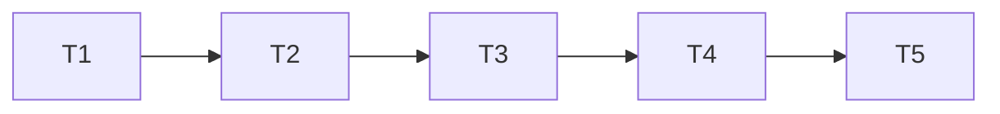

# Plan: Website audit fixes

## Goal

Ship 5 website audit fixes covering install-script supply-chain trust, print-master validation, base-path link integrity, sitemap coverage, and responsive docs layout.

## Scope In

- Exact lockfile-location install-script trust checked before CI rebuild.
- Print-master dimensions enforced during content discovery.
- Base-aware `href`, `src`, and `srcset` checks plus repo-base browser smoke.
- Complete, deduped sitemap routes for docs, posts, blog, and decks.
- 320px docs table and inline-code reflow.
- Focused tests, full website validation, manual checklist.
- One stacked pull request per ticket in dependency order.

## Scope Out

- Dependency or lockfile upgrades.
- Python dependency policy.
- Print-master generation or fallback changes.
- External URL crawling, fragment validation, or HTML parser dependencies.
- Sitemap indexes, `lastmod`, drafts, aliases, or `404`.
- Markdown/content redesign or preformatted code wrapping.
- Pull-request merges.

## Assumptions

- Source plan's recorded lockfile versions and integrities are authoritative only when confirmed against current `website/package-lock.json`.
- Existing APIs and fallback behavior remain stable unless ticket explicitly changes them.
- `ai-artifacts/` is canonical artifact directory for this repo, despite generic skill examples using `ai_artefacts/`.
- Initial implementation remained in the current working tree; a later explicit request authorizes ticket branches, commits, pushes, and pull requests.
- If environment blocks browser/full validation, focused checks still run and blocker is recorded.
- Browser-cancelled responsive/source-upgrade requests report `net::ERR_ABORTED`; repo smoke excludes only this cancellation while still failing other same-origin request errors and all HTTP responses ≥400.
- URL serialization normalizes repo-base root `<loc>` to `/YGO-x-MTG` without trailing slash; every descendant `<loc>` starts `/YGO-x-MTG/`.
- Local WebKit cannot launch because host lacks `libgstreamer-1.0.so.0`; Chromium and Firefox plus focused Chromium coverage provide runnable browser evidence here.

## Ticket Order

| ID | Title | Depends | File |
| --- | --- | --- | --- |
| T1 | Exact install-script trust | none | [`T1_exact-install-script-trust.md`](PLAN_2026_08_13_website_audit_fixes/T1_exact-install-script-trust.md) |
| T2 | Print-master dimensions | T1 | [`T2_print-master-dimensions.md`](PLAN_2026_08_13_website_audit_fixes/T2_print-master-dimensions.md) |
| T3 | Base-path link checker | T2 | [`T3_base-path-link-checker.md`](PLAN_2026_08_13_website_audit_fixes/T3_base-path-link-checker.md) |
| T4 | Sitemap completeness | T3 | [`T4_sitemap-completeness.md`](PLAN_2026_08_13_website_audit_fixes/T4_sitemap-completeness.md) |
| T5 | Docs responsive reflow | T4 | [`T5_docs-responsive-reflow.md`](PLAN_2026_08_13_website_audit_fixes/T5_docs-responsive-reflow.md) |

## Dependency Flow

## Final Validation

- `cd website && npm run ci`
- `cd website && npm run test:e2e`
- `git diff --check`
- `git status --short` confirms no staged files.
- `graphify update .` when `graphify` is available.
