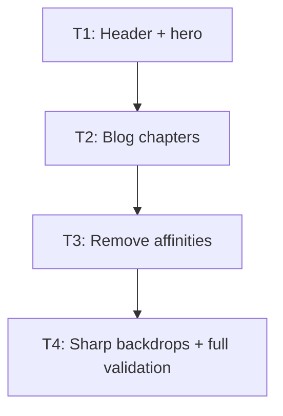

# Plan: feedback follow-up

## Goal

Ship five confirmed website fixes: Cards nav, corrected hero crop, blog chapters, four removed archetype affinities, sharp archetype backdrops. Success = exact UI/data behavior, 400 px header intact, native chapter scroll, full repo gates green.

## Scope

- In: shared header, home hero CSS, blog content schema/routes, identity metadata, related-card output, archetype backdrop CSS, focused tests, generated catalog.
- Out: MSE card fields/files/renders, decklists, card rules/stats/art, new runtime deps, nav redesign, docs TOC redesign, backdrop dim/crop redesign.

## Assumptions

- Caller-mandated plan path uses `ai_artefacts/`; existing historical `ai-artifacts/` stays untouched.
- Blog chapters = H2 only in UI. Loader retains H2-H4 metadata. Native fragments handle scroll; no client JS.
- Four cards become `archetype: null`, `role: "staple"`; stay published under non-archetype.
- Compact header keeps one row at 400 px. Four links use `0.5rem 0.25rem` compact padding; measured Cards width = 48.9 px.
- Archetype backdrop keeps 60% dim layer, `scale(1.01)`, clipping, content-column scope. Only blur leaves.
- Generated `website/src/generated/catalog.ts` changes only through `npm run content`.
- Effective base is `origin/plan/feedback-batch-3`, not default `origin/main`, because ticket inputs require unmerged batch-3 outputs; branch choice avoids reimplementing out-of-scope dependencies.
- User approved narrow baseline ESLint repair in `website/src/components/Navigation.svelte` after T1 repair gate exposed unchanged `no-undef` errors for DOM type globals.
- User explicitly approved current committed display + print render bytes for publication on 2026-08-13 and authorized syncing `website/content/asset-rights.json` to generated inventory.
- Planning docs already present in worktree are outputs of this plan; implementation touches no unrelated file.

## Ticket flowchart

## Ticket order

| ID | Title | Depends | Commit outcome | File |
| --- | --- | --- | --- | --- |
| T1 | Header Cards link + hero crop | — | Cards links home before Learn; hero shows Trishula head; 400 px header stays one row | `PLAN_2026_08_13_feedback_follow_up/T1_header-and-hero.md` |
| T2 | Blog chapter summary | T1 | Blog landing + post routes show right-side H2 links that scroll below sticky header | `PLAN_2026_08_13_feedback_follow_up/T2_blog-chapters.md` |
| T3 | Remove four archetype affinities | T2 | Four generic cards become staples with no Same archetype relation | `PLAN_2026_08_13_feedback_follow_up/T3_remove-archetype-affinities.md` |
| T4 | Sharp archetype backdrops | T3 | Archetype photos render unblurred; dim/geometry remain; all repo gates pass | `PLAN_2026_08_13_feedback_follow_up/T4_remove-backdrop-blur.md` |

## Tickets

- [T1: Header Cards link + hero crop](PLAN_2026_08_13_feedback_follow_up/T1_header-and-hero.md) — depends: none
- [T2: Blog chapter summary](PLAN_2026_08_13_feedback_follow_up/T2_blog-chapters.md) — depends: T1
- [T3: Remove four archetype affinities](PLAN_2026_08_13_feedback_follow_up/T3_remove-archetype-affinities.md) — depends: T2
- [T4: Sharp archetype backdrops](PLAN_2026_08_13_feedback_follow_up/T4_remove-backdrop-blur.md) — depends: T3
